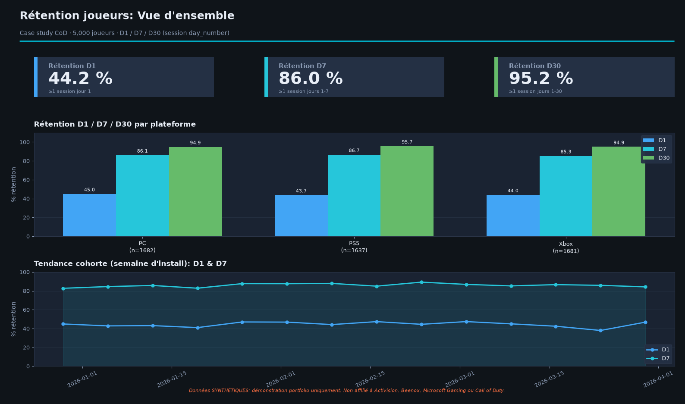
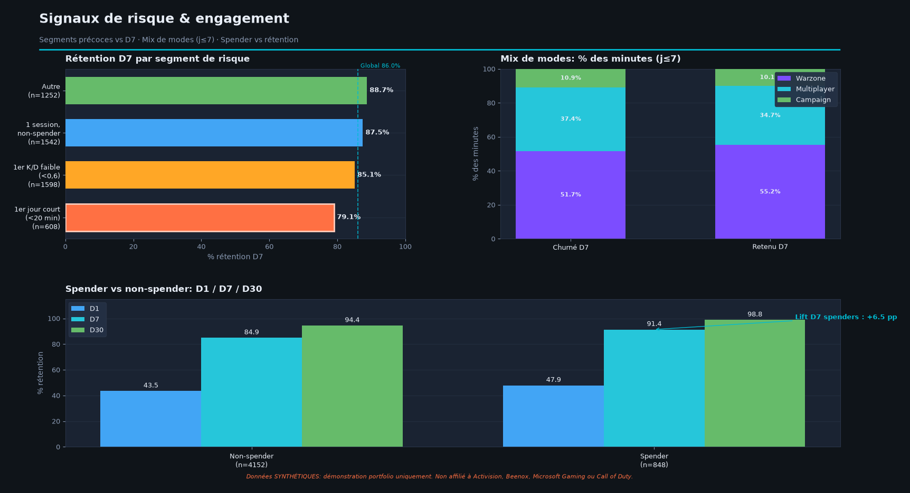
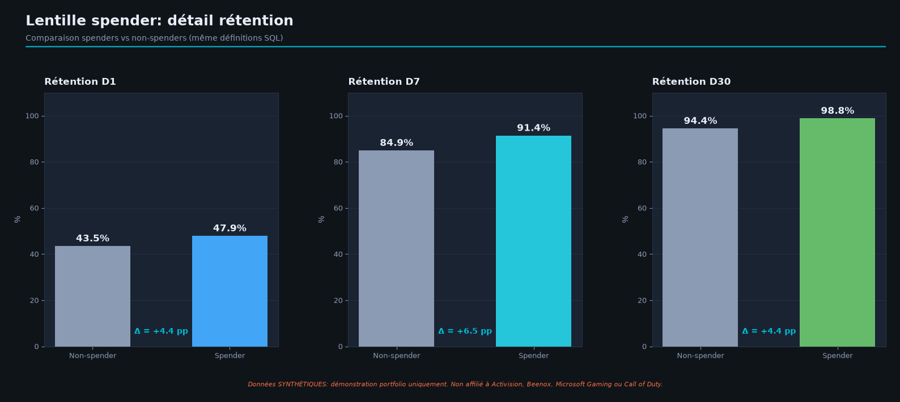

# Call of Duty - Player Retention Analytics (Case Study)

**Portfolio case study** for product analytics / business intelligence roles (e.g. studio live-ops & player insights).

> **Synthetic data only.** Generated for demonstration. **Not affiliated with** Activision, Beenox, Microsoft Gaming, or *Call of Duty*. No real player telemetry.

## Why this exists

Studios running live games need analysts who can turn session data into **retention insights** and **product recommendations**. This project shows that loop end-to-end:

1. Define retention questions (D1 / D7 / D30)
2. Model a realistic synthetic dataset
3. SQL analysis
4. Dashboard visuals (Power BI-equivalent Python figures for portfolio)
5. Three concrete product recommendations

Built by [Rayann Sagnon](https://rayannsagnon.com): product-minded builder, Electrical Engineering & Systems @ University of Ottawa.

## Status

| Piece | Status |
|-------|--------|
| Synthetic dataset + generator | Done |
| Schema docs | Done |
| Starter SQL | Done |
| Dashboard screenshots | Done: Python/matplotlib (Power BI Desktop unavailable); see [`docs/screenshots/`](docs/screenshots/) |
| Power BI `.pbix` | Optional later: brief ready at [`docs/powerbi_build_brief.md`](docs/powerbi_build_brief.md) |
| Product recommendations write-up | Drafted: [`docs/product_recommendations.md`](docs/product_recommendations.md) |

## Dataset (quick facts)

See `data/meta.json` after generation. Default run:

- ~5,000 players
- ~36k sessions over ~60 days post-install
- Optional purchases for a spender segment

Regenerate:

```bash
python3 scripts/generate_synthetic_data.py
```

## Schema

See [`docs/schema.md`](docs/schema.md).

## SQL

| File | Question |
|------|----------|
| `sql/01_retention_cohort.sql` | D1/D7/D30 by cohort × platform |
| `sql/02_churn_risk_signals.sql` | Early risk segments vs D7 |
| `sql/03_mode_engagement.sql` | Mode mix retained vs churned |
| `sql/04_spender_vs_retention.sql` | Spender flag vs retention |

Load CSVs into SQLite / DuckDB / BigQuery / Power BI as you prefer. Some date functions are SQLite-oriented; adapt if needed.

### Quick SQLite load example

```bash
sqlite3 analysis.db <<'SQL'
.mode csv
.import data/players.csv players
.import data/sessions.csv sessions
.import data/purchases.csv purchases
SQL
sqlite3 analysis.db < sql/04_spender_vs_retention.sql
```

## Dashboard

Power BI Desktop n’était pas disponible sur l’environnement de build ; les **captures portfolio** ci-dessous sont générées avec **pandas + matplotlib**, avec les **mêmes définitions** que le SQL (D1 / D7 / D30, segments de risque, mix de modes, spender).

Régénérer : `.venv/bin/python scripts/build_dashboard_figures.py` (voir [`dashboard/README.md`](dashboard/README.md)).

Pour un vrai `.pbix` plus tard : [`docs/powerbi_build_brief.md`](docs/powerbi_build_brief.md).

### Captures

**Page 1: Vue d’ensemble rétention** (cartes D1/D7/D30, plateformes, cohorte)



**Page 2: Signaux de risque & engagement** (segments, modes, spender)



**Page 3: Lentille spender** *(optionnel)*



Ordres de grandeur (run local, 5 000 joueurs) : D1 **44,2 %** · D7 **86,0 %** · D30 **95,2 %** ; `short_first_day` D7 **79,1 %** ; spender D7 **91,4 %** vs non-spender **84,9 %**.

## Product recommendations

Drafted in [`docs/product_recommendations.md`](docs/product_recommendations.md) (template kept at `docs/product_recommendations_template.md`). **3 actions**, each with evidence + success metric.

## Stack

Python 3 · pandas · matplotlib · CSV · SQL · Power BI (brief prêt, `.pbix` optionnel)

## License

MIT for code/docs. Dataset is synthetic fiction for education/portfolio use only.
